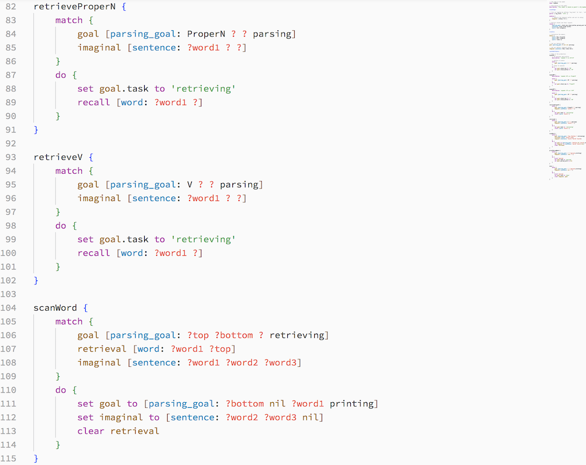
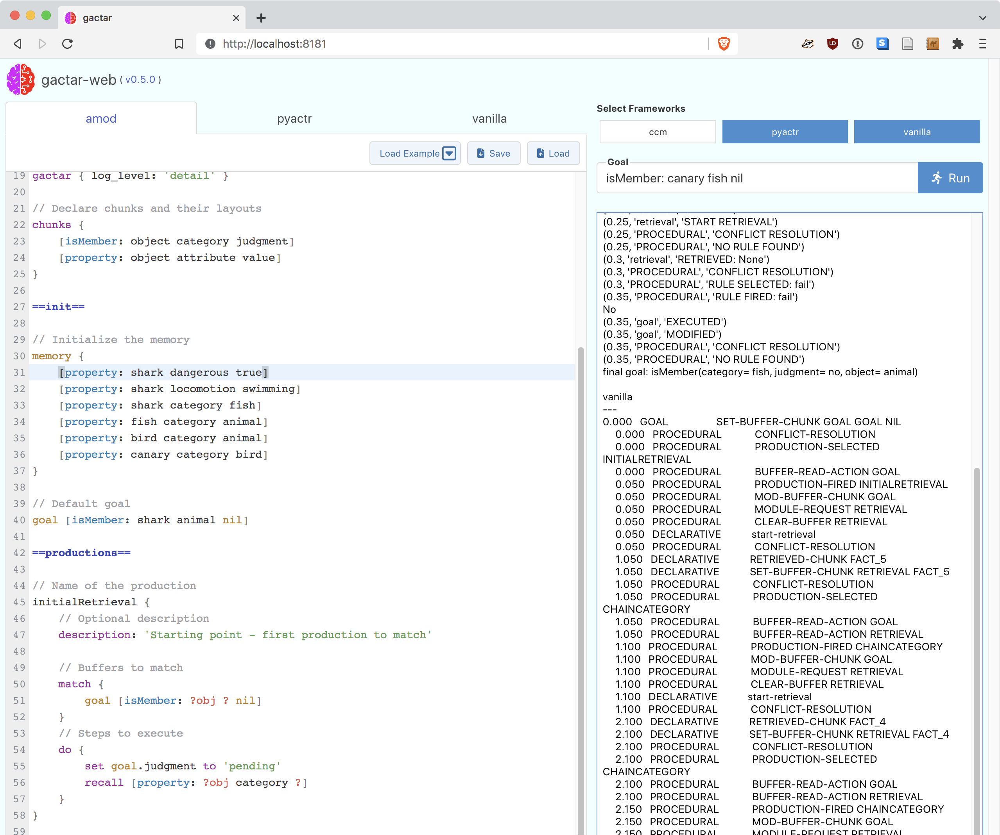
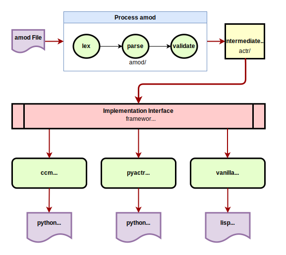

[](https://github.com/asmaloney/gactar/releases/latest) [](https://pkg.go.dev/github.com/asmaloney/gactar) [](LICENSE) 

#  gactar

`gactar` is a tool for creating and running [ACT-R](https://en.wikipedia.org/wiki/ACT-R) models using a declarative file format called _amod_.

You can read the tech note **gactar: A Tool For Exploring ACT-R Modelling** [here](https://dx.doi.org/10.13140/RG.2.2.25387.36642).

## Proof-of-Concept

**This is a proof-of-concept.**

Currently, `gactar` will take an [_amod_ file](#gactar-models) and generate code to run it on three different ACT-R implementations:

- [pyactr](https://github.com/jakdot/pyactr) (python)
- [python_actr](https://github.com/CarletonCognitiveModelingLab/python_actr) (python) - a.k.a. **_ccm_**
- [ACT-R](https://github.com/asmaloney/ACT-R) (lisp) - a.k.a. **_vanilla_**

**Naming note:** When gactar was written, the `python_actr` implementation came from [CCMSuite3](https://github.com/CarletonCognitiveModelingLab/CCMSuite3) and was referred to throughout gactar as `ccm`. Instead of changing everything to refer to `python_actr` I've decided to leave it as `ccm`. This helps avoid confusion between `python_actr` and `pyactr`.

`gactar` will work with the tutorial models included in the _examples_ directory. It doesn't handle a lot beyond what's in there - it only works with memory modules, not perceptual-motor ones, and does not yet work with environments - so _it's limited at the moment_.

Given that gactar in its early stages, the amod syntax may change dramatically based on use and feedback.

**Note for Windows users:** I haven't actually built & run this on Windows directly (the GitHub CI builds it for me). If you try it and have problems, please open [an issue](https://github.com/asmaloney/gactar/issues).

### What isn't implemented?

A lot! The big, obvious one is environments (and therefore the visual & motor modules). That's a big challenge and probably not worth tackling if there isn't sufficient interest in this initial proof of concept. Environments may even prove impossible given the way they are implemented in the three frameworks, but I haven't yet explored this too deeply.

If there is sufficient interest in this project, my strategy going forward would be to continue implementing examples included with the three implementations, adding capabilities as necessary and, when the implementations differ, raising issues for discussion. Once all the non-environment capabilities are implemented, then I would turn to the environment issue.

## Quickstart

There are more details on each step below, but here's the short version:

### Requirements

1. You need to have python 3 installed.

### Download

1. Download the latest [release](https://github.com/asmaloney/gactar/releases) for your platform & decompress the file.

### Install

0. (optional) Rename the folder that was just created (e.g. `gactar-v0.4.0-darwin-amd64`) to something shorter (e.g. `gactar`):

   `mv gactar-v0.4.0-darwin-amd64 gactar`

1. Change to the folder :

   `cd gactar-v0.4.0-darwin-amd64`

   OR

   `cd gactar` (if you did step 0)

2. Run the set up script:

   `./scripts/setup.sh`

### Run

1. Activate the virtual environment:

   `source ./env/bin/activate`

2. Run gactar:

   `gactar -w`

3. Open your browser to the URL it outputs (e.g. http://localhost:8181)

## Why gactar?

1. Provides a human-readable, easy-to-understand, standard format to define basic ACT-R models.
1. Allows the easy exchange of models with other researchers
1. Opens the possibility of a library of models which will run on multiple implementation frameworks.
1. Abstracts away the "programming" to focus on writing and understanding models.
1. Restricts the model to a small language to prevent programming "outside the model" (no sneaking in extra calculations or control-flow!).
1. Runs the same model on multiple ACT-R implementation frameworks.
1. Provides a very simple setup for teaching environments - gactar is self-contained in one executable and uses a setup script to download the implementation frameworks.
1. Generates human-readable code with comments linking back to the amod file which is useful for learning the implementations and comparing them.
1. Parses chunks (including the `examples` in an amod file) to catch and report errors in a user-friendly manner.

   **Example #1 (invalid variable name)**

   ```
    match {
        goal [isMember: ?obj ? nil]
    }
    do {
        recall [property: ?ojb category ?]
    }
   ```

   The CCM Suite implementation _fails silently_ when given invalid variables which makes it difficult to catch errors & can result in incorrect output. Instead of ignoring the incorrect variable, gactar outputs a nice error message so it's obvious what the problem is:

   ```
   recall statement variable '?ojb' not found in matches for production 'initialRetrieval' (line 53)
   ```

   **Example #2 (invalid slot name)**

   ```
    match {
        goal [isMember: ?obj ? nil]
    }
    do {
        set goal.resutl to 'pending'
    }
   ```

   The CCM Suite implementation produces the following error:

   ```
   Traceback (most recent call last):
   File "/path/gactar_Semantic_Run.py", line 8, in <module>
    model.run()
   File "/path/CCMSuite3/ccm/model.py", line 254, in run
    self.sch.run()
   File "/path/CCMSuite3/ccm/scheduler.py", line 116, in run
    self.do_event(heapq.heappop(self.queue))
   File "/path/CCMSuite3/ccm/scheduler.py", line 161, in do_event
    result=event.func(*event.args,**event.keys)
   File "/path/CCMSuite3/ccm/lib/actr/core.py", line 64, in _process_productions
    choice.fire(self._context)
   File "/path/CCMSuite3/ccm/production.py", line 51, in fire
    exec(self.func, context, self.bound)
   File "<production-initialRetrieval>", line 2, in <module>
   File "/path/CCMSuite3/ccm/model.py", line 22, in __call__
    val = self.func(self.obj, *args, **keys)
   File "/path/CCMSuite3/ccm/lib/actr/buffer.py", line 60, in modify
    raise Exception('No slot "%s" to modify to "%s"' % (k, v))
   Exception: No slot "resutl" to modify to "pending"
   end...
   ```

   Instead, by adding validation, gactar produces a much better message:

   ```
   slot 'resutl' does not exist in chunk 'isMember' for match buffer 'goal' in production 'initialRetrieval' (line 52)
   ```

## Design Goals

1. amod syntax & semantics should be designed for humans to read & understand (i.e. it should not require a programming background to grok).
1. amod should only provide one way to perform each action - this helps when reading someone else's code and keeps the parser as simple as possible.
1. amod should only include functionality which is available on all implementation frameworks.
1. gactar should be as simple as possible to set up, use, and understand.

## Contributing

For information on how to contribute (code, bug reports, ideas, or other resources), please see the [CONTRIBUTING](CONTRIBUTING.md) doc.

## Installation

1. Although the `gactar` executable itself is compiled for each platform, it requires **python3** to run the setup and to run the _ccm_ and _pyactr_ implementations. **python3** needs to be somewhere in your `PATH` environment variable.

2. `gactar` requires one or more of the three implementations (_ccm_, _pyactr_, _vanilla_) be installed.

`gactar` uses a python virtual environment to keep all the required python packages, lisp files, and other implementation files in one place so it does not affect the rest of your system. For more information about the virtual environment see the [python docs](https://docs.python.org/3/library/venv.html).

### Download gactar Release

1. Download the latest [release](https://github.com/asmaloney/gactar/releases) for your platform.

2. Decompress the file using the appropriate tool for your platform.

3. You should end up with a folder named something like `gactar-v<version>-<platform>-<architecture>` (e.g. `gactar-v0.4.0-darwin-amd64`) containing the following files & folders:

   |              |                                                                              |
   | ------------ | ---------------------------------------------------------------------------- |
   | CHANGELOG.md | describes changes between versions                                           |
   | CITATION.cff | citation information in [cff format](https://citation-file-format.github.io) |
   | doc/         | folder containing extra documentation                                        |
   | gactar       | the executable                                                               |
   | examples/    | folder containing the examples                                               |
   | LICENSE      | the license                                                                  |
   | README.md    | this readme file                                                             |
   | scripts/     | folder containing the setup scripts                                          |

### Setup Virtual Environment

1. Run `./scripts/setup.sh`
   This will do several things to set up your environment:

   - create a [virtual environment](https://docs.python.org/3/library/venv.html) for the project in a directory called `env`
   - install [pyactr](https://github.com/jakdot/pyactr) and [python_actr](https://github.com/CarletonCognitiveModelingLab/python_actr) using pip
   - download "vanilla" [ACT-R](https://github.com/asmaloney/ACT-R)
   - (macOS-only) download & install the [Steel Bank Common Lisp](http://www.sbcl.org/index.html) (sbcl) compiler
   - (macOS-only) compile the ACT-R lisp files

2. You will need to activate the virtual environment by running this in the terminal before you run `gactar`:

   ```sh
   source ./env/bin/activate
   ```

   If it activated properly, your command line prompt will start with `(env)`. If you want to deactivate it, run `deactivate`.

### (Optional - Linux & Windows) Install SBCL Lisp Compiler

**Note:** On macOS, these steps are handled by running the [setup file](#setup-virtual-environment).

For now this is only automated on macOS because the required files are not easy to determine programmatically. It may be possible to improve this in the future for other operating systems.

1. We are using the [Steel Bank Common Lisp](http://www.sbcl.org/index.html) (sbcl) compiler to compile and run our _vanilla_ framework. Download the correct version [from here](http://www.sbcl.org/platform-table.html) by finding your platform (OS and architecture) in the table and clicking its box. Put the file in the `env` directory and unpack it there.

2. To install it in our environment, change to the new directory it created (e.g. `sbcl-1.2.11-x86-64-darwin`) and run this command (setting the path to wherever the env directory is):

   ```sh
   INSTALL_ROOT=/path/to/gactar/env/ ./install.sh
   ```

3. Once it is successfully installed, go back to the 'env' directory and run the following command to compile the main actr files using the lisp compiler (setting the path to wherever the env directory is):
   ```sh
   export SBCL_HOME=/path/to/env/lib/sbcl; sbcl --script actr/load-single-threaded-act-r.lisp
   ```
   This will take a few moments to compile all the ACT-R files so it is ready to use.

## Running gactar

The following assumes you have set up your virtual environment properly. See [setup](#setup) above.

There are four different ways to use gactar depending on your needs:

1. In [Visual Studio Code](https://code.visualstudio.com/) using the [gactar extension](https://marketplace.visualstudio.com/items?itemName=asmaloney.gactar).
2. With a UI locally in a web browser.
3. Using a command line interface.
4. Using an interactive command line interface.

### Command Line

To run it using methods 2-4, here are the command line options:

```
gactar [OPTIONS] [FILES...]
```

**--debug, -d**: turn on debugging output

**--ebnf**: output amod EBNF to stdout and quit

**--framework, -f** [string]: add framework - valid frameworks: all, ccm, pyactr, vanilla (default: `all`)

**--interactive, -i**: run an interactive shell

**--port, -p** [number]: port to run the web server on (default: `8181`)

**--run, -r**: run the models after generating the code

**--temp** [string]: directory for generated files (it will be created if it does not exist) (default: `./gactar-temp`)

**--web, -w**: start a web server to run in a browser

### 1. Run With Visual Studio Code

I have created a [Visual Studio Code](https://code.visualstudio.com/) extension called _gactar-vscode_ to provide amod syntax highlighting, code snippets, and a command to run gactar.



The extension is [published](https://marketplace.visualstudio.com/items?itemName=asmaloney.gactar) on the VS Code marketplace, so you can install it from within VS Code:

1. Run VS Code.
2. Go to the extensions and search for `gactar`.
3. Click the `Install` button on the gactar extension.
4. Details about using it may be found on the [VS Code extension](https://marketplace.visualstudio.com/items?itemName=asmaloney.gactar) page.

The source code for _gactar-vscode_ may be found [here](https://github.com/asmaloney/gactar-vscode).

### 2. Run As Web Server

gactar includes a web server and will use your browser as a user interface.

```
(env)$ ./gactar -w
ccm: Using Python 3.9.12 from /path/to/gactar/env/bin/python3
pyactr: Using Python 3.9.12 from /path/to/gactar/env/bin/python3
vanilla: Using SBCL 1.2.11 from /path/to/gactar/env/bin/sbcl
Serving gactar on http://localhost:8181
```

Opening `http://localhost:8181` in your browser will let you load, edit, and save amod files, and run them on the implementation frameworks. The page already has an example model loaded, so you can run it by clicking **Run**. You can also:

- select another example using the **Load Example** button
- modify the amod code in the editor
- **Save** the amod code to a file
- **Load** the amod code from a file
- choose which frameworks to run under `Select Frameworks`
- set a **Goal** to override the default goal in the _amod_ file
- once it's been run, browse the generated code using the tabs at the top of the code editor



The results (and any errors) will be shown on the right and the generated code that was used to run the model on each framework is shown in the editor tabs.

**Important Note:** This web server is only intended to be run locally. It should not be used to expose gactar to the internet. Because we are running code, a lot more checking and validation of inputs would be required before doing so.

### 3. Run With Command Line Interface

This will generate code for all active frameworks and optionally run the models.

```
(env)$ ./gactar examples/count.amod
gactar version v0.4.0
pyactr: Using Python 3.9.13 from /path/to/gactar/env/bin/python3
	- Generating code for examples/count.amod
	- written to gactar-temp/pyactr_count.py
vanilla: Using SBCL 1.2.11 from /path/to/gactar/env/bin/sbcl
	- Generating code for examples/count.amod
	- written to gactar-temp/vanilla_count.lisp
ccm: Using Python 3.9.13 from /path/to/gactar/env/bin/python3
	- Generating code for examples/count.amod
	- written to gactar-temp/ccm_count.py
```

You can choose which frameworks to use with `--framework` or `-f` like this:

```
./gactar -f ccm -f vanilla examples/count.amod
gactar version v0.4.0
ccm: Using Python 3.9.13 from /path/to/gactar/env/bin/python3
	- Generating code for examples/count.amod
	- written to gactar-temp/ccm_count.py
vanilla: Using SBCL 1.2.11 from /path/to/gactar/env/bin/sbcl
	- Generating code for examples/count.amod
	- written to gactar-temp/vanilla_count.lisp
```

You can write the files to a different location using `--temp`:

```
./gactar -f ccm -temp intermediate examples/count.amod
gactar version v0.4.0
ccm: Using Python 3.9.13 from /path/to/gactar/env/bin/python3
	- Generating code for examples/count.amod
	- written to intermediate/ccm_count.py
```

You can also choose to run the models using `--run` or `-r`:

```
./gactar -f ccm -temp intermediate -r examples/count.amod
gactar version v0.4.0
ccm: Using Python 3.9.13 from /path/to/gactar/env/bin/python3
	- Generating code for examples/count.amod
	- written to intermediate/ccm_count.py
== ccm ==
   0.000 production_match_delay 0
   0.000 production_threshold None
   0.000 production_time 0.05
   0.000 production_time_sd None
   0.000 memory.error False
   ...
end...
```

### 4. Run With Interactive Command Line Interface

gactar provides a simple interactive command-line mode to load and run models.

```
(env)$ ./gactar -i
gactar version v0.4.0
Type 'help' for a list of commands.
To exit, type 'exit' or 'quit'.
ccm: Using Python 3.9.12 from /path/to/gactar/env/bin/python3
pyactr: Using Python 3.9.12 from /path/to/gactar/env/bin/python3
vanilla: Using SBCL 1.2.11 from /path/to/gactar/env/bin/sbcl
> help
  exit:        exits the program
  frameworks:  choose frameworks to run (e.g. "ccm pyactr", "all")
  help:        exits the program
  history:     outputs your command history
  load:        loads a model: load [FILENAME]
  quit:        exits the program
  reset:       resets the current model
  run:         runs the current model: run [INITIAL STATE]
  version:     outputs version info
> load examples/count.amod
 model loaded
 examples:
       run [countFrom: 2 5 starting]
       run [countFrom: 1 7 starting]
> frameworks ccm
active frameworks: ccm
> run [countFrom: 2 4 starting]
   0.000 production_match_delay 0
   0.000 production_threshold None
   0.000 production_time 0.05
   0.000 production_time_sd None
   0.000 memory.error False
   0.000 memory.busy False
   0.000 memory.latency 0.05
   0.000 memory.threshold 0
   0.000 memory.maximum_time 10.0
   0.000 memory.record_all_chunks False
   0.000 retrieval.chunk None
   0.050 production None
   0.050 memory.busy True
   0.050 goal.chunk countFrom 2 4 counting
   0.100 retrieval.chunk count 2 3
   0.100 memory.busy False
   0.100 production increment
   0.150 production None
2
   0.150 memory.busy True
   0.150 goal.chunk countFrom 3 4 counting
   0.200 retrieval.chunk count 3 4
   0.200 memory.busy False
   0.200 production increment
   0.250 production None
3
   0.250 memory.busy True
   0.250 goal.chunk countFrom 4 4 counting
   0.250 production stop
   0.300 retrieval.chunk count 4 5
   0.300 memory.busy False
   0.300 production None
4
   0.300 goal.chunk None
Total time:    3.250
 goal.chunk None
 memory.busy False
 memory.error False
 memory.latency 0.05
 memory.maximum_time 10.0
 memory.record_all_chunks False
 memory.threshold 0
 production None
 production_match_delay 0
 production_threshold None
 production_time 0.05
 production_time_sd None
 retrieval.chunk count 4 5
end...
> exit
```

You may choose which of the frameworks to run using the `frameworks` command.

Specifying frameworks on the command line will limit you to selecting those frameworks. For example this will make only `ccm` available in interactive mode:

```
./gactar -f ccm -i
```

## Build/Develop

If you want to build `gactar` from scratch, you will need [git](https://git-scm.com/), [make](https://www.gnu.org/software/make/), and the [go compiler](https://golang.org/) installed for your platform.

Then you just need to clone this repository:

```sh
git clone https://github.com/asmaloney/gactar
cd gactar
```

...and run make:

```
make
```

This will create the `gactar` executable.

See the [web README](web/gactar-web/README.md) for information on developing the web interface.

**Note for Windows:** I haven't actually built this on Windows directly (the GitHub CI builds it for me). If you try it and have problems, please open [an issue](https://github.com/asmaloney/gactar/issues).

## Test

To run the built-in tests, from the top-level of the repo run:

```
go test ./...
```

## Web API

gactar provides an HTTP-based API to compile and run amod files. The available endpoints are documented separately in the [Web API documentation](<doc/Web API.md>).

## gactar Models

gactar models are written using the _amod_ format which is designed to be an easy-to-understand description of an ACT-R model.

Here is an example of a gactar model:

```
==model==

// The name of the model (used when generating code and for error messages)
name: count

// Description of the model (currently output as a comment in the generated code)
description: 'This is a model which adds numbers. Based on the ccm u1_count.py tutorial.'

// A list of authors. These are output as comments in the generated code.
authors {
    'Andy Maloney <asmaloney@gmail.com>'
}

// Examples of starting goals to use when running the model
examples {
    [countFrom: 2 5 starting]
    [countFrom: 1 3 starting]
}

==config==

// Turn on logging by setting 'log_level' to 'min', 'info' (default), or 'detail'
gactar { log_level: 'detail' }

// Declare chunks and their layouts
chunks {
    [count: first second]
    [countFrom: start end status]
}

==init==

// Initialize the memory
memory {
    [count: 0 1]
    [count: 1 2]
    [count: 2 3]
    [count: 3 4]
    [count: 4 5]
}

// Default goal
goal [countFrom: 2 5 starting]

==productions==

// Name of the production
start {
    // Optional description
    description: 'Starting point - first production to match'

    // Buffers to match
    match {
        goal [countFrom: ?start ?end starting]
    }
    // Steps to execute
    do {
        recall [count: ?start ?]
        set goal to [countFrom: ?start ?end counting]
    }
}

increment {
    match {
        goal [countFrom: ?x !?x counting]
        retrieval [count: ?x ?next]
    }
    do {
        print ?x
        recall [count: ?next ?]
        set goal.start to ?next
    }
}

stop {
    match {
        goal [countFrom: ?x ?x counting]
    }
    do {
        print ?x
        clear goal
    }
}
```

You can find other examples of `amod` files in the [examples folder](examples).

### amod Syntax

The EBNF ([Extended Backus–Naur form](https://en.wikipedia.org/wiki/Extended_Backus%E2%80%93Naur_form)) grammar for the amod file format may be found [here](doc/amod%20EBNF.txt).

### Buffers

In ACT-R, a buffer is the interface between modules, such as the goal & declarative memory modules, and the production system. At any point in time, each buffer either stores one instance of a _chunk_ (see next section) or it is empty.

gactar uses several built-in buffers:

- `goal` stores the current goal
- `retrieval` stores a chunk retrieved from declarative memory using a `recall` statement (see below)
- `imaginal` stores context related to the current task

### Chunks

A _chunk_ is a piece of data that adheres to a user-defined structure. These chunks are stored as facts in the declarative memory and are placed in _buffers_ where they may be matched, read, and modified.

The structure of each chunk type is declared in the _config_ section. Chunks are delineated by square brackets. The first item is the chunk name and the items after the colon are the slot names:

```
[chunk_name: slot_name1 slot_name2 ...]
```

Examples:

```
[count: first second]
[word: form category]
[property: object attribute value]
```

#### Special Chunks

User-defined chunks must not begin with underscore ('\_') - these are reserved for internal use. Currently there is one internal chunk - `_status` - which is used to check the status of buffers.

It is used in a `match` as follows:

```
match {
    goal [_status: full]
    retrieval [_status: error]
}
```

Valid statuses include:

- `full` - the buffer contains a chunk
- `empty` - the buffer does not contain a chunk
- `busy` - the buffer is in the process of being filled
- `error` - the last retrieval failed

### Productions

A production is essentially a fancy _if-then_ statement which checks some conditions and modifies state. In gactar, they take the form:

```
(production_name) {
    match {
        (some buffer conditions)
    }
    do {
        (some actions)
    }
}
```

This may be read as **if** _(all buffer conditions match)_ **then** _(do all the specified actions)_.

The production name is used to trace the output when running a model.

#### match

The _match_ section matches buffers by _pattern_. These patterns match the chunks previously declared in the _config_ section and are parsed to ensure their format is consistent. The syntax of these patterns is inspired by&mdash;but not the same as&mdash;the _ccm_ implementation of ACT-R.

Variables in production matches are preceded by `?` (e.g. `?object`). On its own `?` denotes a wildcard (i.e. "match anything"). Using `!` negates the logic.

#### Example #1:

```
retrieval [count: ?x ?next]
```

This matches the `retrieval` buffer if it contains a `count` chunk, and assigns the contents to the two variables `?x` and `?next`.

#### Example #2:

```
goal [countFrom: ?x !?x counting]
```

This matches the `goal` buffer if it contains a `countFrom` chunk, the first two slots do not contain the same value, and the third slot contains `counting`. It assigns `?x` the contents of the first slot.

#### Example #3:

```
goal [add: ? ?num2 ?count!?num2 ?sum]
```

This matches the `goal` buffer if it contains an `add` chunk, the first slot is any value, and the third slot is not the same value as the second. It assigns `?num2` the contents of the second slot, `?count` the value of the third, and `?sum` the value of the fourth.

#### do

The _do_ section in the productions tells the system what actions to take if the buffers match. It uses a small language which currently understands the following commands:

| command                                                                  | example                                 |
| ------------------------------------------------------------------------ | --------------------------------------- |
| **clear** _(buffer name)+_                                               | **clear** goal, retrieval               |
| **print** _(string or var or number)+_                                   | **print** 'text', ?var, 42              |
| **recall** _(pattern)_                                                   | **recall** [car: ?colour]               |
| **set** _(buffer name)_._(slot name)_ **to** _(string or var or number)_ | **set** goal.wall_colour **to** ?colour |
| **set** _(buffer name)_ **to** _(pattern)_                               | **set** goal **to** [start: 6 nil]      |

### Example Production #1

```
increment {
    match {
        goal [countFrom: ?x !?x counting]
        retrieval [count: ?x ?next]
    }
    do {
        print ?x
        recall [count: ?next ?]
        set goal.start to ?next
    }
}
```

This production is called `increment`. It attempts to match the `goal` buffer to a `countFrom` chunk, and the `retrieval` buffer to a `count` chunk. If they match, then it will `print` the contents of the `?x` variable, lookup a `count` chunk in memory and set the `retrieval` buffer to it, and `set` the `start` slot of the `goal` buffer to the contents of the variable `?next`.

### Example Production #2

```
done {
    match {
        goal [parsing_goal: ? ? ?parsed printing]
        imaginal [sentence: nil ? ?]
    }
    do {
        print ?parsed
        set goal.task to 'done'
        clear imaginal, goal
    }
}
```

This production is called `done`. It attempts to match the `goal` buffer to a `parsing_goal` chunk, and the `imaginal` buffer to a `sentence` chunk. If they match, then it will `print` the contents of the `?parsed` variable, `set` the `task` slot of the `goal` buffer to `'done'`, and clear both the `imaginal` and `goal` buffers.

## amod Processing

The following diagram shows how an _amod_ file is processed by gactar. The partial paths at the bottom of the items is the path to the source code responsible for that part of the processing.



## Reference

If you need to reference this project, I wrote up a technical note which may be found on [ResearchGate](https://www.researchgate.net/).

**Title:** gactar: A Tool For Exploring ACT-R Modelling

**DOI:** [10.13140/RG.2.2.25387.36642](https://dx.doi.org/10.13140/RG.2.2.25387.36642)
