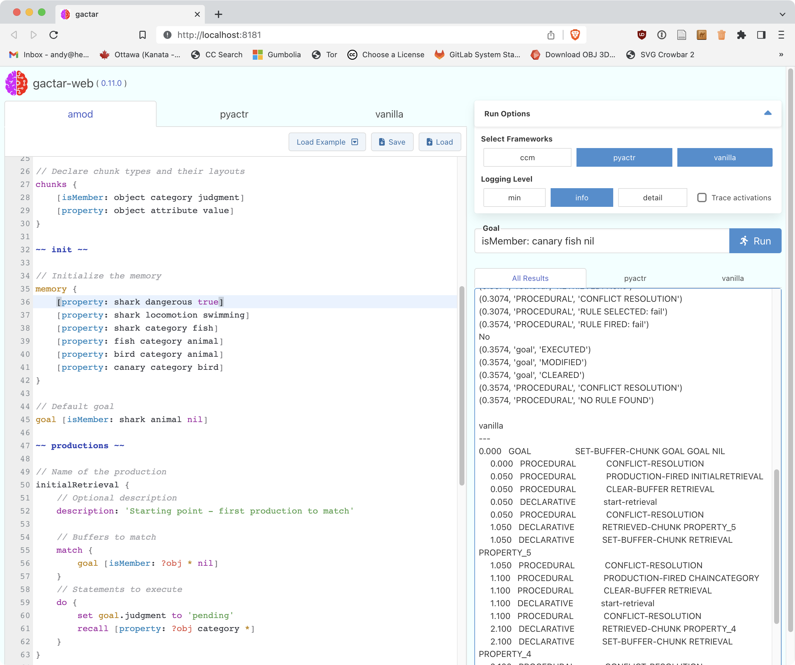

[](https://github.com/asmaloney/gactar/releases/latest) [](https://pkg.go.dev/github.com/asmaloney/gactar) [](LICENSE) 

#  gactar

`gactar` is a tool for creating and running [ACT-R](https://en.wikipedia.org/wiki/ACT-R) models using a declarative file format called _amod_.

The initial writeup as a tech note: **[gactar: A Tool For Exploring ACT-R Modelling](https://dx.doi.org/10.13140/RG.2.2.25387.36642)**

## Table of Contents

- [Overview](#overview)
  - [Why gactar?](#why-gactar)
  - [Design Goals](#design-goals)
  - [What Is Not Implemented?](#what-is-not-implemented)
- [Quickstart](#quickstart)
  - [Requirements](#requirements)
  - [Install](#install)
  - [Run](#run)
- [Installation](#installation)
  - [Download gactar Release](#download-gactar-release)
  - [Setup](#setup)
- [Updating Your Environment](#updating-your-environment)
- [Checking Your Environment For Errors](#checking-your-environment-for-errors)
- [Running gactar](#running-gactar)
  - [Run With Visual Studio Code](#1-run-with-visual-studio-code)
  - [Run As Web Server](#2-run-as-web-server)
  - [Run With Command Line Interface](#3-run-with-command-line-interface)
  - [Run With Interactive Command Line Interface](#4-run-with-interactive-command-line-interface)
- [Build/Develop](#builddevelop)
- [Test](#test)
- [Web API](#web-api)
- [gactar Models](#gactar-models)
  - [amod Syntax](#amod-syntax)
  - [Config Section](#config-section)
  - [Buffers](#buffers)
  - [Chunks](#chunks)
  - [Productions](#productions)
  - [Example Production \#1](#example-production-1)
  - [Example Production \#2](#example-production-2)
- [amod Processing](#amod-processing)
- [Reference](#reference)
- [Contributing](#contributing)

---

## Overview

`gactar` takes an [_amod_ file](#gactar-models) and generates code to run it on three different ACT-R implementations:

- [pyactr](https://github.com/jakdot/pyactr) (Python)
- [python_actr](https://github.com/asmaloney/python_actr) (Python) - a.k.a. **_ccm_**
- [ACT-R](https://github.com/asmaloney/ACT-R) (Lisp) - a.k.a. **_vanilla_**

`gactar` will work with the tutorial models included in the _examples_ directory. It doesn't handle a lot beyond what's in there - it only works with memory modules, not perceptual-motor ones, and does not yet work with environments - so _it's limited at the moment_.

Given that gactar is in its early stages, the amod syntax may change dramatically based on use and feedback.

**Naming note:** When gactar was written, the `python_actr` implementation came from [CCMSuite3](https://github.com/CarletonCognitiveModelingLab/CCMSuite3) and was referred to throughout gactar as `ccm`. Instead of changing everything to refer to `python_actr` I've decided to leave it as `ccm`. This helps avoid confusion between `python_actr` and `pyactr`.

**Note about python_actr:** The version of `python_actr` used here is a [fork](https://github.com/asmaloney/python_actr) of the [original](https://github.com/CarletonCognitiveModelingLab/python_actr). The original wasn't being updated, so I created a new pip package called [actr](https://pypi.org/project/actr/) which still uses `python_actr` as its Python package name.

### Why gactar?

1. Provides a human-readable, easy-to-understand, standard format to define basic ACT-R models.
1. Abstracts away the "programming" to focus on writing & understanding models.
1. Restricts the model to a small language to prevent programming "outside the model" (no sneaking in extra calculations or control-flow!).
1. Runs the same model on multiple ACT-R implementation frameworks so the output may be compared.
1. Generates human-readable code with comments linking back to the amod file which is useful for learning the implementations and comparing them.
1. Provides a very simple setup for teaching environments - gactar is self-contained in one executable and downloads the implementation frameworks itself.
1. Allows the easy exchange of models with other researchers
1. Opens up the possibility of a library of models which will run on multiple implementation frameworks.

### Design Goals

1. amod syntax & semantics should be designed for humans to read & understand (i.e. it should not require a programming background to grok).
1. amod should only provide one way to perform each action - this helps when reading someone else's code and keeps the parser as simple as possible.
1. amod should only include functionality which is available on all implementation frameworks.
1. gactar should be as simple as possible to set up, use, and understand.

### What Is Not Implemented?

The big, obvious one is environments (and therefore the visual & motor modules). That's a big challenge and probably not worth tackling if there isn't sufficient interest in this initial implementation. Environments may even prove impossible given the way they are implemented in the three frameworks, but I haven't yet explored this too deeply.

If there is sufficient interest in this project, my strategy going forward would be to continue implementing examples included with the three implementations, adding capabilities as necessary and, when the implementations differ, raising issues for discussion. Once all the non-environment capabilities are implemented I would turn to the environment issue.

## Quickstart

There are more details on each step below, but here's the short version:

### Requirements

1. Access to a **command line interface** (cli) to run gactar. Generally something bash-compatible will work best.

   - macOS: Terminal or [iTerm](https://iterm2.com/)
   - Linux: it is a command line interface
   - Windows: [Git Bash](https://gitforwindows.org/) or [cygwin](https://www.cygwin.com/) or Powershell (? not sure which ones work)

2. **python 3** is required by two of the frameworks (ccm & pyactr). More about Python installation [here](https://github.com/asmaloney/gactar/wiki/Python).

### Install

1. Download the latest [release](https://github.com/asmaloney/gactar/releases) for your platform & architecture and decompress the file.

   - arm64 if you have an ARM processor (e.g. Apple's M1)
   - amd64 otherwise

2. (optional) Rename the folder that was just created (e.g. `gactar-v0.x-macOS-amd64`) to something shorter (e.g. `gactar`):

   `mv gactar-v0.x-macOS-amd64 gactar`

3. In your command line interface, change to the folder :

   `cd gactar-v0.x-macOS-amd64`

   OR

   `cd gactar` (if you did step 2)

4. Run the set up tool:

   `./gactar env setup`

For more details, [see below](#installation).

### Run

1. Run gactar:

   `./gactar web`

2. Open your browser to the URL it outputs (e.g. http://localhost:8181)

For more details and other options for running gactar, [see below](#running-gactar).

## Installation

1. Access to a **command line interface** (cli) is required to run gactar. Generally something bash-compatible will work best.

   - macOS: Terminal or [iTerm](https://iterm2.com/)
   - Linux: it is a command line interface
   - Windows: [Git Bash](https://gitforwindows.org/) or [cygwin](https://www.cygwin.com/) or Powershell (? not sure which ones work)

1. **python 3** is required by two of the frameworks (ccm & pyactr). More about Python installation [here](https://github.com/asmaloney/gactar/wiki/Python).

1. `gactar` requires that one or more of the three implementations (_ccm_, _pyactr_, _vanilla_) is installed. _ccm_ and _pyactr_ are both Python-based and will be installed using _pip_ (if Python is available). _vanilla_ requires a Lisp compiler which will be installed by the setup command.

`gactar` uses a virtual environment to keep all the required Python packages, Lisp files, and other implementation files in one place so it does not affect the rest of your system. For more information about the Python virtual environment see the [python docs](https://docs.python.org/3/library/venv.html).

### Download gactar Release

1. Download the latest [release](https://github.com/asmaloney/gactar/releases) for your platform & architecture and decompress the file.

   - arm64 if you have an ARM processor (e.g. Apple's M1)
   - amd64 otherwise

2. You should end up with a folder named something like `gactar-v<version>-<platform>-<architecture>` (e.g. `gactar-v0.8.0-macOS-amd64`) containing the following files & folders:

   |                 |                                                                              |
   | --------------- | ---------------------------------------------------------------------------- |
   | CHANGELOG.md    | describes changes between versions                                           |
   | CITATION.cff    | citation information in [cff format](https://citation-file-format.github.io) |
   | CONTRIBUTING.md | how to contribute to the project - financially & otherwise                   |
   | doc/            | folder containing extra documentation                                        |
   | gactar          | the executable                                                               |
   | examples/       | folder containing the examples                                               |
   | install/        | folder containing Python package information used for setup                  |
   | LICENSE         | the license                                                                  |
   | README.md       | this readme file                                                             |

### Setup

Setup is handled using the `gactar env setup` command.

```
USAGE:
   gactar env setup [command options] [arguments...]

OPTIONS:
   --dev                 install any dev packages (default: false)
   --path value, -p value  directory for env files (it will be created if it does not exist) (default: "./env")
```

For basic setup, run `./gactar env setup`

This will do several things to set up your environment:

- create a [virtual environment](https://docs.python.org/3/library/venv.html) for the project in a directory called `env`
- install [pyactr](https://github.com/jakdot/pyactr) and [python_actr](https://github.com/asmaloney/python_actr) using pip
- download the _vanilla_ [ACT-R](https://github.com/asmaloney/ACT-R) Lisp code
- download the [Clozure Common Lisp compiler](https://ccl.clozure.com/) (ccl) compiler

Use the `--dev` flag to also install optional developer packages for linting & formatting Python code.

```
$ ./gactar env setup --dev
```

If you want to change the default environment (`env`), the directory can be specified using the `-path` option:

```
./gactar env setup -path foo
```

**Note:** If you change the default environment, you will need to specify `--env foo` each time you run gactar.

## Updating Your Environment

To update the Python version in your environment to the current Python on your system:

```
./gactar env update --python
```

To update the Python pip packages (python-actr, pyactr, and support packages) to the versions in install/requirements.txt (add `--dev` to include development packages):

```
./gactar env update --pip
```

To update both Python & its packages (add `--dev` to include development packages):

```
./gactar env update --all
```

## Checking Your Environment For Errors

To run a health check on your virtual environment, run:

```
./gactar env doctor
```

To check a specific virtual environment, you can pass its path using the `--env` option:

```
./gactar env doctor --env foo
```

This command will run several checks on your environment and report any warnings or errors.

## Running gactar

The following assumes you have set up your virtual environment properly. See [setup](#setup) above.

There are four different ways to use gactar depending on your needs:

1. In [Visual Studio Code](https://code.visualstudio.com/) using the [gactar extension](https://marketplace.visualstudio.com/items?itemName=asmaloney.gactar).
2. With a UI locally in a web browser.
3. Using a command line interface.
4. Using an interactive command line interface.

### Command Line

For the command-line methods (2-4), run `./gactar help` for a list of commands and options:

```
Usage:
  gactar [flags]
  gactar [command]

Available Commands:
  cli         Run an interactive shell
  completion  Generate the autocompletion script for the specified shell
  ebnf        Output amod EBNF to stdout and quit
  env         Setup & maintain an environment
  help        Help about any command
  module      Get info about available modules
  web         Start a web server to run in a browser

Flags:
  -d, --debug strings       turn on debugging - valid options: lex, parse, exec
      --env string          directory where ACT-R, pyactr, and other necessary files are installed (default "./env")
  -f, --framework strings   add framework - valid frameworks: all, ccm, pyactr, vanilla (default [all])
  -h, --help                help for gactar
      --no-colour           do not use colour output on command line
  -r, --run                 run the models after generating the code
      --temp string         directory for generated files (it will be created if it does not exist - defaults to <env>/gactar-temp)
  -v, --version             output the version and quit

Use "gactar [command] --help" for more information about a command.
```

### 1. Run With Visual Studio Code

I have created a [Visual Studio Code](https://code.visualstudio.com/) extension called _gactar-vscode_ to provide amod syntax highlighting, code snippets, and a command to run gactar.


The extension is [published](https://marketplace.visualstudio.com/items?itemName=asmaloney.gactar) on the VS Code marketplace, so you can install it from within VS Code:

1. Run VS Code.
2. Go to the extensions and search for `gactar`.
3. Click the `Install` button on the gactar extension.
4. Details about using it may be found on the [VS Code extension](https://marketplace.visualstudio.com/items?itemName=asmaloney.gactar) page.

The source code for _gactar-vscode_ may be found [here](https://github.com/asmaloney/gactar-vscode).

### 2. Run As Web Server

gactar includes a web server and can use your browser as its user interface.

Run `./gactar help web` for a list of options.

```
(env)$ ./gactar web
gactar version v0.11.0
Using virtual environment: "/path/to/gactar/env"
ccm: Using Python 3.10.9
pyactr: Using Python 3.10.9
vanilla: Using Version 1.12.1 (v1.12.1) DarwinX8664
Serving gactar on http://localhost:8181
```

Opening `http://localhost:8181` in your browser will let you load, edit, and save amod files, and run them on the implementation frameworks. The page already has an example model loaded, so you can run it by clicking **Run**. You can also:

- select another example using the **Load Example** button
- modify the amod code in the editor
- **Save** the amod code to a file
- **Load** the amod code from a file
- choose which frameworks to run under `Select Frameworks`
- set a **Goal** to override the default goal in the _amod_ file
- once it's been run, browse the generated code using the tabs at the top of the code editor



The results (and any errors) will be shown on the right and the generated code that was used to run the model on each framework is shown in the editor tabs.

**Important Note:** This web server is only intended to be run locally. It should not be used to expose gactar to the internet. Because we are running code, a lot more checking and validation of inputs would be required before doing so.

### 3. Run With Command Line Interface

This will generate code for all active frameworks and optionally run the models.

Run `./gactar help` for a list of options.

```
(env)$ ./gactar examples/count.amod
gactar version v0.11.0
Using virtual environment: "/path/to/gactar/env"
ccm: Using Python 3.10.9
pyactr: Using Python 3.10.9
vanilla: Using Version 1.12.1 (v1.12.1) DarwinX8664
Intermediate file path: "/path/to/gactar/env/gactar-temp"
Generating model for examples/count.amod
INFO: initial goal is [countFrom: 2 5 starting]
 ccm
	- generating code for examples/count.amod
	- written to gactar-temp/ccm_count.py
 pyactr
	- generating code for examples/count.amod
	- written to gactar-temp/pyactr_count.py
 vanilla
	- generating code for examples/count.amod
	- written to gactar-temp/vanilla_count.lisp
```

You can choose which frameworks to use with `-framework` or `-f` like this:

```
(env)$ ./gactar -f ccm -f vanilla examples/count.amod
gactar version v0.11.0
Using virtual environment: "/path/to/gactar/env"
ccm: Using Python 3.10.9
vanilla: Using Version 1.12.1 (v1.12.1) DarwinX8664
Intermediate file path: "/path/to/gactar/env/gactar-temp"
Generating model for examples/count.amod
INFO: initial goal is [countFrom: 2 5 starting]
 ccm
	- generating code for examples/count.amod
	- written to gactar-temp/ccm_count.py
 vanilla
	- generating code for examples/count.amod
	- written to gactar-temp/vanilla_count.lisp
```

You can write the files to a different location using `-temp`:

```
(env)$ ./gactar -f ccm -temp intermediate examples/count.amod
gactar version v0.11.0
Using virtual environment: "/path/to/gactar/env"
ccm: Using Python 3.10.9
Intermediate file path: "/path/to/gactar/env/gactar-temp"
Generating model for examples/count.amod
INFO: initial goal is [countFrom: 2 5 starting]
 ccm
	- generating code for examples/count.amod
	- written to intermediate/ccm_count.py
```

You can also choose to run the models using `-run` or `-r`:

```
(env)$ ./gactar -f ccm -temp intermediate -r examples/count.amod
gactar version v0.11.0
Using virtual environment: "/path/to/gactar/env"
ccm: Using Python 3.10.9
Intermediate file path: "/path/to/gactar/env/gactar-temp"
Generating model for examples/count.amod
INFO: initial goal is [countFrom: 2 5 starting]
 ccm
	- generating code for examples/count.amod
	- written to intermediate/ccm_count.py
== ccm ==
   0.000 production_match_delay 0
   0.000 production_threshold None
   0.000 production_time 0.05
   0.000 production_time_sd None
   0.000 memory.error False
   ...
end...
```

### 4. Run With Interactive Command Line Interface

gactar provides a simple interactive command-line mode to load and run models.

Run `./gactar help cli` for a list of options.

```
(env)$ ./gactar cli
gactar version v0.11.0
Using virtual environment: "/path/to/gactar/env"
ccm: Using Python 3.10.9
pyactr: Using Python 3.10.9
vanilla: Using Version 1.12.1 (v1.12.1) DarwinX8664
Type 'help' for a list of commands.
To exit, type 'exit' or 'quit'.
> help
  exit:        exits the program
  frameworks:  choose frameworks to run (e.g. "ccm pyactr", "all")
  help:        exits the program
  history:     outputs your command history
  load:        loads a model: load [FILENAME]
  quit:        exits the program
  reset:       resets the current model
  run:         runs the current model: run [INITIAL STATE]
  version:     outputs version info
> load examples/count.amod
 model loaded
 examples:
       run [countFrom: 2 5 starting]
       run [countFrom: 1 7 starting]
> frameworks ccm
active frameworks: ccm
> run [countFrom: 2 4 starting]
   0.000 production_match_delay 0
   0.000 production_threshold None
   0.000 production_time 0.05
   0.000 production_time_sd None
   0.000 memory.error False
   0.000 memory.busy False
   0.000 memory.latency 0.05
   0.000 memory.threshold 0
   0.000 memory.maximum_time 10.0
   0.000 memory.record_all_chunks False
   0.000 retrieval.chunk None
   0.050 production None
   0.050 memory.busy True
   0.050 goal.chunk countFrom 2 4 counting
   0.100 retrieval.chunk count 2 3
   0.100 memory.busy False
   0.100 production increment
   0.150 production None
2
   0.150 memory.busy True
   0.150 goal.chunk countFrom 3 4 counting
   0.200 retrieval.chunk count 3 4
   0.200 memory.busy False
   0.200 production increment
   0.250 production None
3
   0.250 memory.busy True
   0.250 goal.chunk countFrom 4 4 counting
   0.250 production stop
   0.300 retrieval.chunk count 4 5
   0.300 memory.busy False
   0.300 production None
4
   0.300 goal.chunk None
Total time:    3.250
 goal.chunk None
 memory.busy False
 memory.error False
 memory.latency 0.05
 memory.maximum_time 10.0
 memory.record_all_chunks False
 memory.threshold 0
 production None
 production_match_delay 0
 production_threshold None
 production_time 0.05
 production_time_sd None
 retrieval.chunk count 4 5
end...
> exit
```

You may choose which of the frameworks to run using the `frameworks` command.

Specifying frameworks on the command line will limit you to selecting those frameworks. For example this will make only `ccm` available in interactive mode:

```
./gactar cli -f ccm
```

## Build/Develop

If you want to build `gactar` from scratch, you will need [git](https://git-scm.com/), [make](https://www.gnu.org/software/make/), and the [go compiler](https://golang.org/) installed for your platform.

Then you just need to clone this repository:

```sh
git clone https://github.com/asmaloney/gactar
cd gactar
```

...and run make:

```
make
```

This will create the `gactar` executable.

See the [web README](modes/web/gactar-web/README.md) for information on developing the web interface.

## Test

To run the built-in tests, from the top-level of the repo run:

```
make test
```

## Web API

gactar provides an HTTP-based API to compile and run amod files. The available endpoints are documented separately in the [Web API documentation](<doc/Web API.md>).

## gactar Models

gactar models are written using the _amod_ format which is designed to be an easy-to-understand description of an ACT-R model.

Here is an example of a gactar model:

```
~~ model ~~

// The name of the model (used when generating code and for error messages)
name: count

// Description of the model (currently output as a comment in the generated code)
description: 'This is a model which adds numbers. Based on the ccm u1_count.py tutorial.'

// A list of authors. These are output as comments in the generated code.
authors {
    'Andy Maloney <asmaloney@gmail.com>'
}

// Examples of starting goals to use when running the model
examples {
    [countFrom: 2 5 'starting']
    [countFrom: 1 3 'starting']
}

~~ config ~~

gactar {
    // Logging level can be 'min', 'info' (default), or 'detail'
    log_level: 'detail'

    // Show detailed information about activations (if available)
    trace_activations: false
}

// Declare chunk types and their layouts
chunks {
    [count: first second]
    [countFrom: start end status]
}

~~ init ~~

// Initialize the memory
memory {
    // Initializers can have an optional chunk name like this:
    one     [count: 0 1]
    two     [count: 1 2]
    three   [count: 2 3]
    four    [count: 3 4]
    five    [count: 4 5]
}

// Default goal
goal [countFrom: 2 5 'starting']

~~ productions ~~

// Name of the production
begin {
    // Optional description
    description: 'Starting point - first production to match'

    // Buffers to match
    match {
        goal [countFrom: ?start ?end 'starting']
    }
    // Statements to execute
    do {
        recall [count: ?start *]
        set goal to [countFrom: ?start ?end 'counting']
    }
}

increment {
    match {
        goal [countFrom: ?x !?x 'counting']
        retrieval [count: ?x ?next]
    }
    do {
        print ?x
        recall [count: ?next *]
        set goal.start to ?next
    }
}

end {
    match {
        goal [countFrom: ?x ?x 'counting']
    }
    do {
        print ?x
        stop
    }
}
```

You can find other examples of `amod` files in the [examples folder](examples).

### amod Syntax

The EBNF ([Extended Backus–Naur form](https://en.wikipedia.org/wiki/Extended_Backus%E2%80%93Naur_form)) grammar for the amod file format may be found [here](<doc/amod EBNF.txt>).

### Config Section

For amod configuration options and a list of supported modules, please see [amod Config](<doc/amod Config.md>).

### Buffers

In ACT-R, a buffer is the interface between modules, such as the goal & declarative memory modules, and the production system. At any point in time, each buffer either stores one instance of a _chunk_ (see next section) or it is empty.

gactar uses several built-in buffers:

- `goal` stores the current goal
- `retrieval` stores a chunk retrieved from declarative memory using a `recall` statement (see below)
- `imaginal` stores context related to the current task

### Chunks

A _chunk_ is a piece of data that adheres to a user-defined structure. These chunks are stored as facts in the declarative memory and are placed in _buffers_ where they may be matched, read, and modified.

The structure of each chunk type is declared in the _config_ section. Chunks are delineated by square brackets. The first item is the chunk name and the items after the colon are the slot names:

```
[chunk_name: slot_name1 slot_name2 ...]
```

Examples:

```
[count: first second]
[word: form category]
[property: object attribute value]
```

#### Special Chunks

User-defined chunks must not begin with underscore ('\_') - these are reserved for internal use.

### Productions

A production is essentially a fancy _if-then_ statement which checks some conditions and modifies state. In gactar, they take the form:

```
(production_name) {
    match {
        (some buffer conditions)
    }
    do {
        (some actions)
    }
}
```

This may be read as **if** _(all buffer conditions match)_ **then** _(do all the specified actions)_.

The production name is used to trace the output when running a model.

#### match

The _match_ section allows checking buffer and module states, and matching buffers by _pattern_.

Checking the buffer state takes the form `buffer_state <buffer> <state>`. For example, to check if the retrieval buffer is full:

```
buffer_state retrieval full
```

Valid buffer states are:

- `empty` - the buffer does not contain a chunk and the failure flag is clear
- `full` - there is currently a chunk in the buffer

Checking the module state takes the form `module_state <module> <state>`. For example, to check if the memory module is in the error state:

```
module_state memory error
```

Valid module states are:

- `busy` - the module is currently handling a request
- `error` - the last request resulted in some sort of error
- `free` - the module is ready for new requests

Matching buffer patterns reply on the chunks previously declared in the _config_ section and are parsed to ensure their format is consistent.

Variables in production matches are preceded by `?` (e.g. `?object`). `*` denotes a wildcard (i.e. "match anything"). Using `!` negates the logic.

Every pattern match has an optional _when_ clause to add constraints to variable matches (see [example #3](#example-3) below).

#### Example #1:

```
retrieval [count: ?x ?next]
```

This matches the `retrieval` buffer if it contains a `count` chunk, and assigns the contents to the two variables `?x` and `?next`.

#### Example #2:

```
goal [countFrom: ?x !?x counting]
```

This matches the `goal` buffer if it contains a `countFrom` chunk, the first two slots do not contain the same value, and the third slot contains `counting`. It assigns `?x` the contents of the first slot.

#### Example #3:

```
goal [add: * ?num2 ?count ?sum] when (?count != ?num2)
```

This matches the `goal` buffer if it contains an `add` chunk, the first slot is any value, and the third slot is not the same value as the second. It assigns `?num2` the contents of the second slot, `?count` the value of the third, and `?sum` the value of the fourth.

#### do

The _do_ section in the productions tells the system what actions to take if the buffers match. It uses a small language which currently understands the following commands:

| command                                                                | example                                 |
| ---------------------------------------------------------------------- | --------------------------------------- |
| **clear** _(buffer name)+_                                             | **clear** goal, retrieval               |
| **print** _(string or var or number)+_                                 | **print** 'text', ?var, 42              |
| **print** _(buffer name) or (buffer name).(slot name)_                 | **print** retrieval.name                |
| **recall** _(pattern)_                                                 | **recall** [car: ?colour]               |
| **set** _(buffer name).(slot name)_ **to** _(string or var or number)_ | **set** goal.wall_colour **to** ?colour |
| **set** _(buffer name)_ **to** _(pattern)_                             | **set** goal **to** [start: 6 nil]      |
| **stop**                                                               | **stop**                                |

### Example Production #1

```
increment {
    match {
        goal [countFrom: ?x !?x counting]
        retrieval [count: ?x ?next]
    }
    do {
        print ?x
        recall [count: ?next ?]
        set goal.start to ?next
    }
}
```

This production is called `increment`. It attempts to match the `goal` buffer to a `countFrom` chunk, and the `retrieval` buffer to a `count` chunk. If they match, then it will `print` the contents of the `?x` variable, lookup a `count` chunk in memory and set the `retrieval` buffer to it, and `set` the `start` slot of the `goal` buffer to the contents of the variable `?next`.

### Example Production #2

```
done {
    match {
        goal [parsing_goal: * * ?parsed printing]
        imaginal [sentence: nil * *]
    }
    do {
        print ?parsed
        set goal.task to 'done'
        clear imaginal, goal
    }
}
```

This production is called `done`. It attempts to match the `goal` buffer to a `parsing_goal` chunk, and the `imaginal` buffer to a `sentence` chunk. If they match, then it will `print` the contents of the `?parsed` variable, `set` the `task` slot of the `goal` buffer to `'done'`, and clear both the `imaginal` and `goal` buffers.

## amod Processing

The following diagram shows how an _amod_ file is processed by gactar. The partial paths at the bottom of the items is the path to the source code responsible for that part of the processing.


## Reference

If you need to reference this project, I wrote up a technical note which may be found on [ResearchGate](https://www.researchgate.net/).

**Title:** gactar: A Tool For Exploring ACT-R Modelling

**DOI:** [10.13140/RG.2.2.25387.36642](https://dx.doi.org/10.13140/RG.2.2.25387.36642)

## Contributing

For information on how to contribute (code, bug reports, ideas, or other resources), please see the [CONTRIBUTING](CONTRIBUTING.md) doc.
